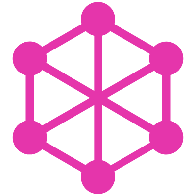

# Hello, folks ! 👋

## **About Me**

I'm a full-stack web3 developer from the India. I mainly code in Javascript aand solidity.I recently fell in love with React and Next.js.I am always learning.I love the idea of decentralization and I want to contribute as much as possible to make this world more decentralize so we can build a place where everyone will treated fairly.I am an active member of Developer DAO and Learn web3 DAO, a DAO for web3 developer.I recently started to contribute in few projects web3, I am currently focus on building a decentralize OTT platform.I love to watch and play cricket.

## **My Tech Stack**
 

## **Blockchain Ecosystem**
 

### **Frontend Stack**
 

&nbsp;&nbsp;&nbsp;&nbsp;

&nbsp;&nbsp;&nbsp;&nbsp;

&nbsp;&nbsp;&nbsp;&nbsp;

&nbsp;&nbsp;&nbsp;&nbsp;

&nbsp;&nbsp;&nbsp;&nbsp;

&nbsp;&nbsp;&nbsp;&nbsp;

&nbsp;&nbsp;&nbsp;&nbsp;

## **Backend Stack**
 

&nbsp;&nbsp;&nbsp;&nbsp;

&nbsp;&nbsp;&nbsp;&nbsp;

&nbsp;&nbsp;&nbsp;&nbsp;

&nbsp;&nbsp;&nbsp;&nbsp;

&nbsp;&nbsp;&nbsp;&nbsp;

## **My Github Numbers**

### **Github Streaks Stats**

 
 

### **Language Stats**

 
  
  

#### **My Stats**

 
 

## **My Soacial links**
 
 

[![Twitter][1.1]][1]
&nbsp;&nbsp;&nbsp;&nbsp;
&nbsp;&nbsp;&nbsp;&nbsp;
&nbsp;&nbsp;&nbsp;&nbsp;
&nbsp;&nbsp;&nbsp;&nbsp;
&nbsp;&nbsp;&nbsp;&nbsp;
&nbsp;&nbsp;&nbsp;&nbsp;
&nbsp;&nbsp;&nbsp;&nbsp;
[![Linkdin][2.1]][2]
&nbsp;&nbsp;&nbsp;&nbsp;
&nbsp;&nbsp;&nbsp;&nbsp;
&nbsp;&nbsp;&nbsp;&nbsp;
&nbsp;&nbsp;&nbsp;&nbsp;
&nbsp;&nbsp;&nbsp;&nbsp;
&nbsp;&nbsp;&nbsp;&nbsp;
[![Github][3.1]][3]
&nbsp;&nbsp;&nbsp;&nbsp;
&nbsp;&nbsp;&nbsp;&nbsp;
&nbsp;&nbsp;&nbsp;&nbsp;
&nbsp;&nbsp;&nbsp;&nbsp;
&nbsp;&nbsp;&nbsp;&nbsp;
&nbsp;&nbsp;&nbsp;&nbsp;
[![Instagram][4.1]][4]
&nbsp;&nbsp;&nbsp;&nbsp;
&nbsp;&nbsp;&nbsp;&nbsp;
&nbsp;&nbsp;&nbsp;&nbsp;
&nbsp;&nbsp;&nbsp;&nbsp;
&nbsp;&nbsp;&nbsp;&nbsp;
&nbsp;&nbsp;&nbsp;&nbsp;

[1.1]: ./assets/002-twitter.png (twitter icon with padding)
[2.1]: ./assets/001-linkedin.png (Linkdin icon with padding)
[3.1]: ./assets/004-github.png (Github icon with padding)
[4.1]: ./assets/003-instagram.png (Instagram icon with padding)

[1]: https://twitter.com/ujjwalt63396692
[2]: https://www.linkedin.com/in/ujjwal-thakur-44aa5823a/
[3]: https://github.com/UjjwalThakur065
[4]: https://www.instagram.com/ujjwal903/

 

